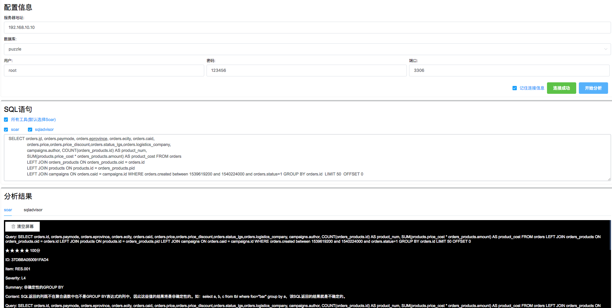

IYSQL - Improve Your SQL

#### 介绍

基于[SQLAdvisor](https://github.com/Meituan-Dianping/SQLAdvisor)与[Soar](https://github.com/XiaoMi/soar)的开源Web分析工具。

#### 文档

[设计文档](./docs/design-arch.md)
[安装](./docs/install.md)

#### Demo

#### 依赖

- [Vue](http://vuejs.org)
- [Element-UI](https://element.eleme.io/#/)
- [Flask](http://flask.pocoo.org/)
- [Python3](https://www.python.org)